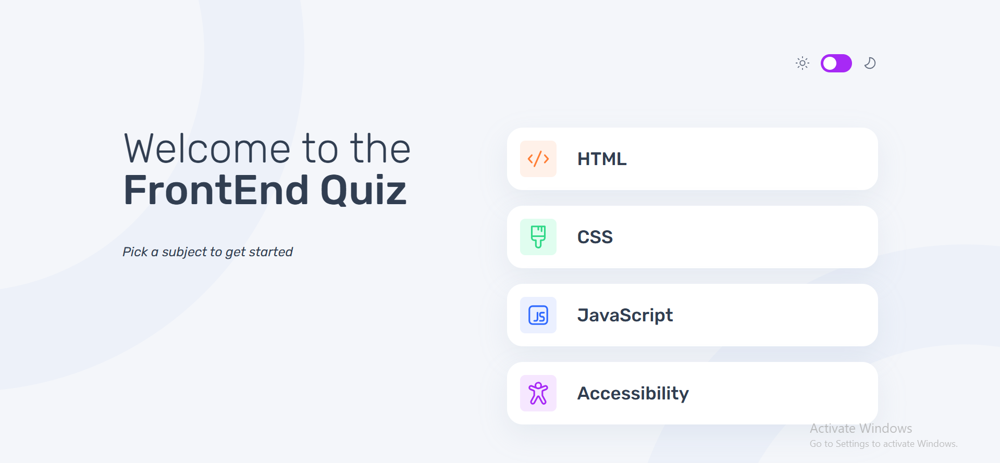
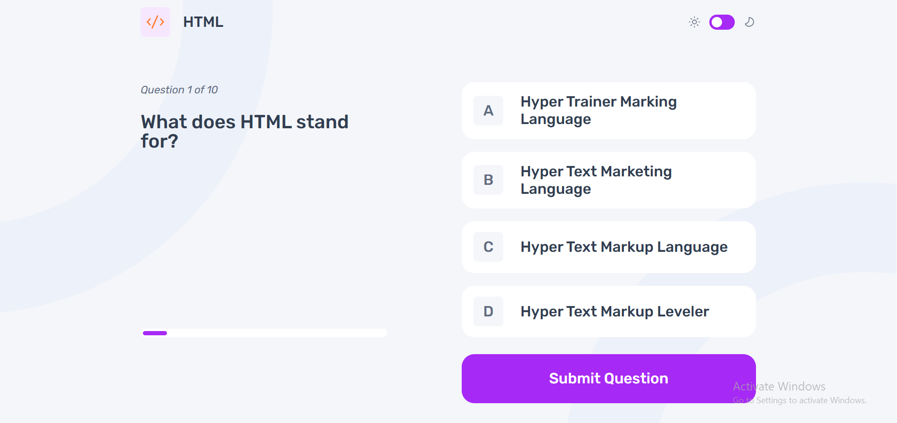
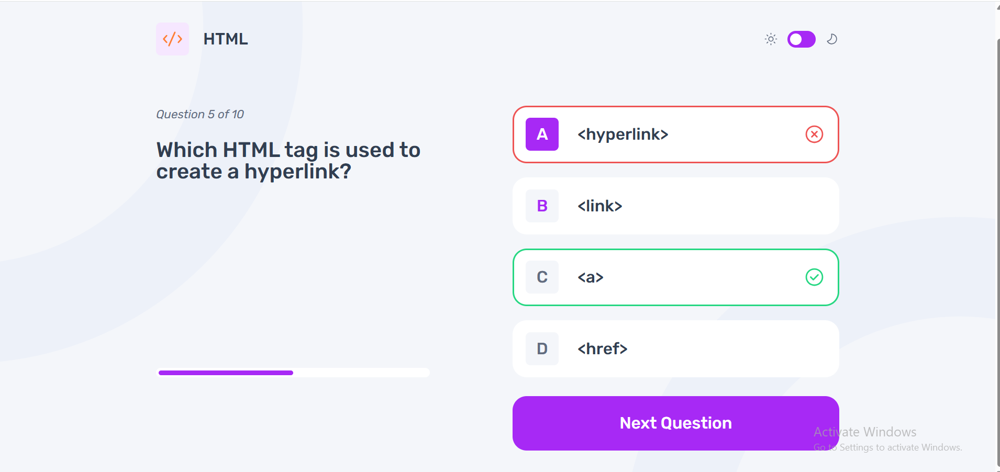
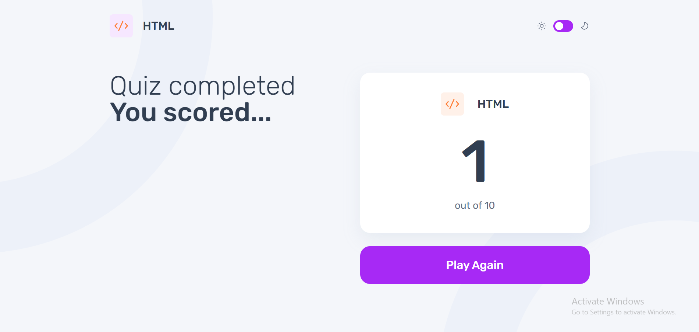

# 🧠 QuizApp — Interactive Quiz Learning Platform

**QuizApp** is a modern, responsive quiz platform built with **React**, designed to help users learn HTML, CSS, JavaScript, and Accessibility concepts.  
The app features real-time answer validation, progress tracking, and a polished UI built with **custom CSS**, offering a smooth and engaging learning experience.

---

## 🔗 Live Demo

👉 https://your-vercel-link-here.vercel.app/  
_(Add your Vercel URL)_

---

## 🚀 Technologies Used

- ⚛️ **React**
- 🎨 **Custom CSS** (per-component styling)
- 📡 **Local JSON (mock API)**
- 🧭 **React Router**
- 🔧 **JavaScript (ES6+)**
- ⚙️ **Vite**
- ☁️ **Vercel Deployment**

---

## ⚡ Features

### 📝 Quiz System

- Four categories: **HTML**, **CSS**, **JavaScript**, **Accessibility**
- Each quiz includes:
  - 10 questions
  - 4 options
  - 1 correct answer
- Questions dynamically loaded from `/data/db.json`

### ⏱ Real-Time Feedback

- Shows immediate correct/incorrect result
- Highlights selected option
- Smooth question transitions

### 📊 Results Page

- Final score summary
- Correct answers count
- Restart quiz with **Try Again**

### 🧭 Navigation System

- Clean homepage with category cards
- Error page for invalid routes
- Category icons stored in `/public/assets`

### 📱 Responsive UI

- Fully responsive
- Mobile-first layout
- Smooth interactive animations

---

## 🏗️ Architecture Overview

- **Frontend:** React
- **Data Source:** `data/db.json`
- **State Management:** React hooks
- **Routing:** React Router
- **UI:** Custom CSS
- **Fetching:** Custom React hooks
- **Deployment:** Vercel

---

## 📂 Project Structure

```txt
quiz-app/
│── data/
│   └── db.json               # All quiz categories + questions
│
│── public/
│   └── assets/               # Icons and images used in UI
│
│── src/
│   ├── components/           # Reusable UI components
│   │   ├── MenuLink/
│   │   ├── Navbar/
│   │   ├── QuizCard/
│   │   └── ...
│   │
│   ├── fonts/                # Custom fonts
│   │
│   ├── hooks/                # Custom hooks for data fetching
│   │   └── useQuiz.js
│   │
│   ├── layout/               # MainLayout (Header + Footer wrapper)
│   │   └── MainLayout.jsx
│   │
│   ├── pages/                # Application pages
│   │   ├── Home/
│   │   ├── Quiz/
│   │   ├── ErrorPage/
│   │   └── ...
│   │
│   ├── App.jsx               # Root component
│   ├── index.css             # Global styles
│   └── main.jsx              # Entry point
│
├── package.json
├── vite.config.js
└── README.md


📸 Screenshots

🏠 Homepage
<p align="center">
    
</p>

🧠 Quiz Flow
<p align="center">
    
</p>

🔗 Validation Page
<p align="center">
    
</p>

📊 Results Page
<p align="center">
    
</p>
```

📥 Installation & Setup

git clone https://github.com/YOUR_USERNAME/quiz-app.git
cd quiz-app

🧑‍💻 Developer

Muzaffar Nematjonov
Junior Full-Stack Developer

GitHub: https://github.com/Muzaffarfullstack

Portfolio: https://vercel.com/muzaffars-projects-08394859
